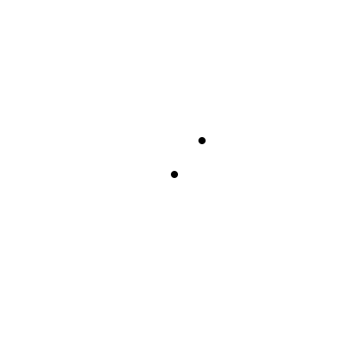
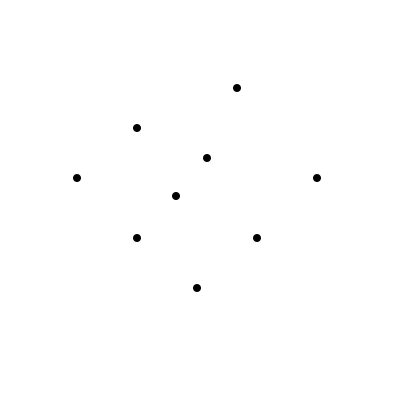
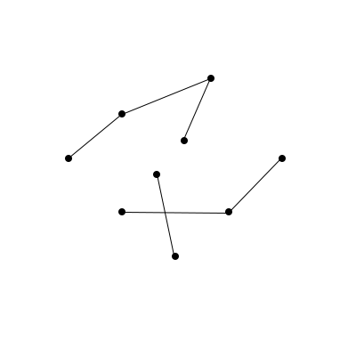
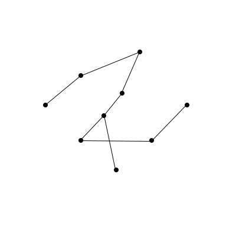
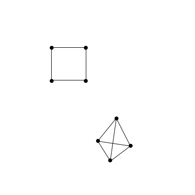
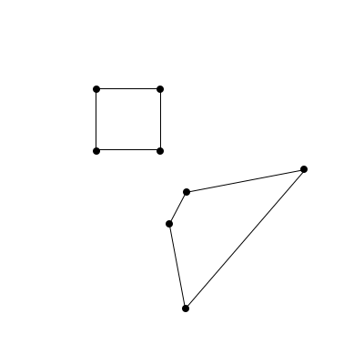
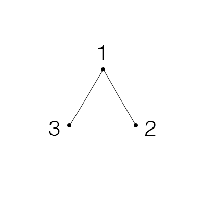
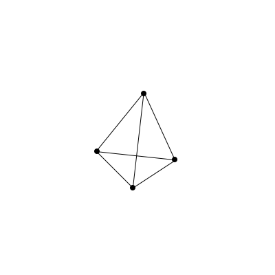
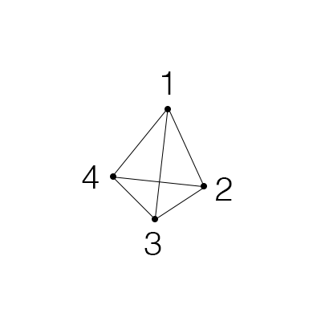
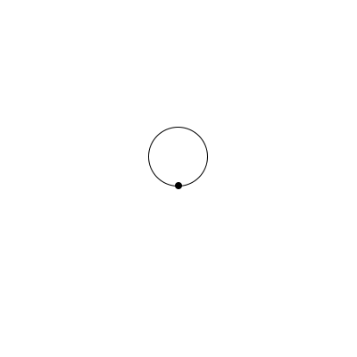

## Math education is tragic

Most people despise math. They remember being forced to do arithmetic by hand in elementary school, algebra by hand in middle school, and (sometimes) calculus by hand in high school. They lament the inability to use a calculator when it's _clearly_ always going to be possible to do so in 'real life'. It is an absolute travesty that this process of low-utility algorithmic memorization is what the word 'mathematics' has come to mean in the minds of people all around the world. It has deprived billions of people from grasping the inherent beauty in pondering things that humans can _know_ to be true. When done correctly and in the right domain, reductionist reasoning allows one to perceive the numinous in the purest form that the universe can offer it.

This problem with math education, of course, has been noted by people both better at math and better at writing than I. The best explanation of it that I've found is _A Mathematician's Lament_ by Paul Lockhart ([link](https://www.maa.org/external_archive/devlin/LockhartsLament.pdf)). I recommend you read the whole thing, but this excerpt is particularly salient.

---

The Standard School Mathematics Curriculum

LOWER SCHOOL MATH. The indoctrination begins. Students learn that mathematics is not
something you do, but something that is done to you. Emphasis is placed on sitting still, filling
out worksheets, and following directions. Children are expected to master a complex set of
algorithms for manipulating Hindi symbols, unrelated to any real desire or curiosity on their part,
and regarded only a few centuries ago as too difficult for the average adult. Multiplication tables
are stressed, as are parents, teachers, and the kids themselves.

MIDDLE SCHOOL MATH. Students are taught to view mathematics as a set of procedures,
akin to religious rites, which are eternal and set in stone. The holy tablets, or “Math Books,” are
handed out, and the students learn to address the church elders as “they” (as in “What do they
want here? Do they want me to divide?”) Contrived and artificial “word problems” will be
introduced in order to make the mindless drudgery of arithmetic seem enjoyable by comparison.
Students will be tested on a wide array of unnecessary technical terms, such as ‘whole number’
and ‘proper fraction,’ without the slightest rationale for making such distinctions. Excellent
preparation for Algebra I.

ALGEBRA I. So as not to waste valuable time thinking about numbers and their patterns, this
course instead focuses on symbols and rules for their manipulation. The smooth narrative thread
that leads from ancient Mesopotamian tablet problems to the high art of the Renaissance
algebraists is discarded in favor of a disturbingly fractured, post-modern retelling with no
characters, plot, or theme. The insistence that all numbers and expressions be put into various
standard forms will provide additional confusion as to the meaning of identity and equality.
Students must also memorize the quadratic formula for some reason.

...

There is such breathtaking depth and heartbreaking beauty in this ancient art form. How
ironic that people dismiss mathematics as the antithesis of creativity. They are missing out on an
art form older than any book, more profound than any poem, and more abstract than any abstract.
And it is school that has done this! What a sad endless cycle of innocent teachers inflicting
damage upon innocent students. We could all be having so much more fun.

---

I hope that you sympathize with everyone that has undergone the experience Lockhart describes. It's brutalizing. It's soul-crushing. It's sickening.

Luckily, I studied math in college and was able to go beyond the layers of nonsense that were piled upon me by the K-12 educational system. I now understand that math is gorgeous, and I understand why people devote their entire lives to studying it. However, most people _don't_ understand, so I want to give a glimpse of the beauty that I speak of. To do so, we must begin from scratch.
 
## Graphs from scratch

Imagine drawing a dot on the screen.

{:height="300px" width="300px"}

Now, imagine drawing another dot.

{:height="300px" width="300px"}

And now a whole bunch more dots!

{:height="300px" width="300px"}

Okay, so we've got a bunch of individual dots, all hanging out in 2-dimensional space. Let's start connecting them while making sure that every dot is connected to at least one other dot.

{:height="300px" width="300px"}

This looks pretty cool! Dots and connections between them are what mathematicians call _graphs_. The best mathematicians in the world have been studying them, on and off, for about 200 years. This alone should tell you something interesting is happening here -- some of the smartest people in the world, the geekiest of the geeks, devote their entire professional lives to tinkering with and studying these (seemingly) simple little things.

Back to our imaginations, though. Notice how there are some places in the graph where you if you start at a certain dot and try to get to another dot, there's no connection? This seems bad!

{:height="300px" width="300px"}

Something about our rule from earlier, that 'every dot needs to be connected to at least one other dot', isn't quite good enough. What we need to do is say that 'starting at any dot in the graph, you need to be able to get to every other dot in the graph by going along the connections'. Let's try and add some connections so that this works. 

{:height="300px" width="300px"}

Great! We can now pick any two dots in the entire graph, and there's a way to go between them. Mathematicians call graphs where you can do this _connected._ Connected graphs are a nice way to think about interesting shapes. For example, these shapes are all connected graphs!

{:height="300px" width="300px"}

Although the above shapes are pretty, let's look at two fairly basic connected graphs, the square and the pyramid. The square is nice, we can draw it flatly on paper. The pyramid, though, is a bit trickier. We're forced to be clever when we squish it onto the paper, and because connections cross each other, it loses the structure that makes it look nice in 3D.

{:height="300px" width="300px"}

It'd be nice if there were some way to represent the dots and connections of the pyramid without having to cleverly squish it down to a 2-dimensional drawing. How might we do this? Try giving it some thought. Think about which features of the graph are important – think about if these two graphs are the same:

{:height="300px" width="300px"}

In some meaningful way, they are! In 99.9% of cases, mathematicians consider the above two graphs to be _identical_. This is kind of weird though -- it means that the only important thing about graphs is the dots and the relationships between them! In a way, then, this graph:

{:height="300px" width="300px"}

Is the same thing as merely _saying_ that 'There are 3 dots. Dot 1 and dot 2 are connected, dot 2 and dot 3 are connected, and dot 3 and dot 1 are connected.' Let's invent some way of expressing those relationships with less words. If two dots are connected, let's put them in some parentheses and separate them by a comma, like this: $$(dot_{1},dot_{2})$$. 

We can do better. Instead of calling them dot 1 and dot 2, let's just use their numbers, like this: $$(1,2)$$. The order of the numbers doesn't matter though, so we could flip-flop any of them inside of their parentheses if we wanted to. In a way, these numbers and parentheses really _are_ the dots and edges.

And now, if we want to talk about a bunch of the dots and edges, we just list a bunch of those numbers and parentheses, like this: $$(1,2), (2,3), (3,1)$$. It looks weird to not enclose those pairs of parentheses and numbers with something though, and it would be confusing to just use more parentheses, so let's use curly braces, like this: $$\{(1,2), (2,3), (3,1)\}$$.

Mathematicians have fancy names for all of the ideas that we just came up with, but fancy names make it hard to focus on the part of math that matters, so I'm not mentioning them here. If you want to read more, check out this footnote.[^1]

[^1]: Putting two numbers inside of parentheses is called a _pair._ When it doesn't matter in which order we put the numbers inside of the parentheses, it's called an _unordered pair,_ and we'd write that for whatever dots you want, call them dot a and dot b, we have that $$(a,b)=(b,a)$$. When it does matter in which order we put the numbers, it's called an _ordered pair,_ and we'd write that $$(a,b) \ne (b,a)$$. If the order of the dots in the parentheses doesn't matter for the entire graph, we call the graph _undirected._ If the order of the dots does matter, we call the graph _directed._ The connections between dots in directed graphs are usually drawn with arrows instead of lines, because you can think of there being a correct way of going from one dot to another.

Let's go back to that pyramid from earlier.

{:height="300px" width="300px"}

To accomplish our goal of representing the dots and connections of the pyramid without having to cleverly squish the 3-dimensional shape down to 2, all we have to do is label the dots and then translate their relationships into numbers and parentheses. Easy!

{:height="300px" width="300px"}

After translation, the pyramid is actually just this list of pairs of numbers in parentheses: $$\{(1,2),(2,3),(3,1),(1,4),(2,4),(3,4)\}$$. There's a lot of repeated stuff in that list of parentheses and numbers though, so maybe there's a better way to keep track of all the information. Let's try doing that with a square of numbers, where if there's a connection between dot a and dot b, we put a $$1$$ in the $$a$$th column and $$b$$th row of the square. That's a lot to think about at once, so let's go one pair of numbers in the list at a time!

We have 4 dots, so we need 4 columns and 4 rows in our square of numbers. Because of this, notice how we'll always end up using _squares_ instead of ugly rectangles: 

$$\begin{bmatrix}0 & 0 & 0 & 0 \\ 0 & 0 & 0 & 0 \\ 0 & 0 & 0 & 0 \\ 0 & 0 & 0 & 0 \end{bmatrix}$$

If you graduated high school, you've probably noticed that this is just a matrix. Matrices are, as it turns out, useful ways of encoding information about graphs. Unfortunately, the word 'matrix' is burned into most peoples' minds as quasi-traumatic, and matrices are fundamentally just squares and rectangles of numbers, so I'll keep calling them that. Now, the first pair is $$(1,2)$$, so let's put a $$1$$ in the spot at the 1st column and 2nd row: 

$$\begin{bmatrix}0 & 0 & 0 & 0 \\ 1 & 0 & 0 & 0 \\ 0 & 0 & 0 & 0 \\ 0 & 0 & 0 & 0 \end{bmatrix}$$

But the order of the numbers in the pair doesn't matter, so we also have to remember the pair $$(2,1)$$ and then put a $$1$$ in the spot at the 2nd column and 1st row:

$$\begin{bmatrix}0 & 1 & 0 & 0 \\ 1 & 0 & 0 & 0 \\ 0 & 0 & 0 & 0 \\ 0 & 0 & 0 & 0 \end{bmatrix}$$

Notice how there's a symmetry to the square? Because order doesn't matter for the numbers in the pair, whichever pair you choose will always have a _twin_ pair where the numbers are flipped. In our number-square, the twins show up on the opposite side of the diagonal that runs from the top left to the bottom right!

Let's do one more example of putting a pair and its twin into the square. The next pair in the original list is $$(2,3)$$, and its twin is $$(3,2)$$, so we put $$1$$s into the spot at the 2nd column and 3rd row, and also into the spot at the 3rd column and 2nd row:

$$\begin{bmatrix}0 & 1 & 0 & 0 \\ 1 & 0 & 1 & 0 \\ 0 & 1 & 0 & 0 \\ 0 & 0 & 0 & 0 \end{bmatrix}$$

I'll fill out the rest for you:

$$\begin{bmatrix}0 & 1 & 1 & 1 \\ 1 & 0 & 1 & 1 \\ 1 & 1 & 0 & 1 \\ 1 & 1 & 1 & 0 \end{bmatrix}$$

Woah! I hope you think this is cool! This beautiful looking square of numbers just popped out of nowhere! Let's think about it though – why would we have a square where everything is filled in except the diagonal? I encourage you to stop and try to reason through it. If you're not feeling up to it though, that's cool too – just look below.

{:height="300px" width="300px"}

Well, the spaces in the main diagonal represent connections between a dot and itself, but we don't have any of those in the pyramid. The math-y word for 'a connection between a dot and itself' is a _loop._ Loops look like this:

{:height="300px" width="300px"}

So if a graph has no loops, then its corresponding square of numbers will have 0s in the main diagonal. But what about all the 1s? Why is _every other possible spot_ in the graph's number-square filled with a 1? Well, it's because _every dot in the graph is connected directly to every other dot._ Look at the pyramid again, and think about this for a second:

{:height="300px" width="300px"}

Whichever dot I pick in the pyramid, I can get to any other dot by only going across one connection! Mathematicians usually call this kind of graph _dense._ We just figured out something really interesting -- if we take a random, perhaps extremely complicated graph, and go through this simple operation of translating it into pairs of numbers and then a square of numbers, we can _instantly_ see whether or not it's dense. All we have to do is check if there are any zeroes that _aren't_ on the diagonal.

We started with nothing but our intuition and pictures, then made up a language for thinking about those pictures, then made up another language to think about our first language, and out popped a beautiful relationship! We can now translate _any_ graph into a number-square, and it magically becomes incredibly easy to know whether or not that graph is dense. We took a normally very complicated, difficult-to-test property, and made it easy enough for a pre-schooler to check. 

_This_ is what math is. Math is the act of starting somewhere interesting and just messing around, playing, until cool things start popping out. 

It's enthralling, it's visceral, and it's extremely fun. Reasoning from scratch is one of the purest joys that our world has to offer, and I hope you see at least some of the beauty and appeal of doing it.

I'm deeply sorry if it wasn't shown to you any earlier in your life, but now is your opportunity to go out and explore! 

As some fun follow-up questions to get you started, can you think about what a dense graph would look like with 5 dots instead of 4? What about 6, 7, or 10,000 dots? Can you write down what the number-squares would look like for those graphs, even without knowing what the graphs look like themselves?

If you're interested in stuff like this, check out [3blue1brown](https://www.youtube.com/watch?v=xdIjYBtnvZU) on YouTube. He makes beautiful videos that take you on this same type of mental adventure. The numinous awaits!

---