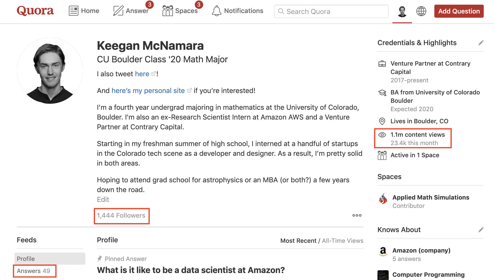
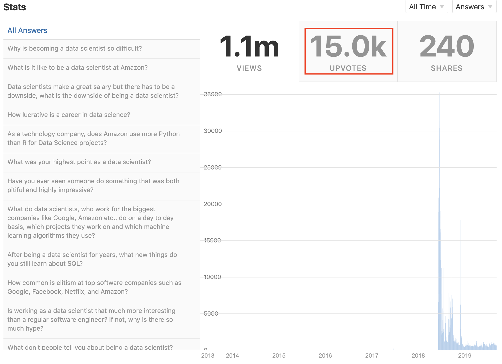

I spent a few months last year trying to see how efficiently I could game the website [Quora](https://www.quora.com/) – the goal was to gain a large amount of followers and views in a very short amount of time. My efforts were rather successful, and this is an analysis of how that happened.

## stats
As a starting point, here are the four core stats from my Quora profile at the time of this post's writing (screenshots included for a dash of verifiability).
* Followers: 1,444
* Content Views: 1,100,000
* Content Upvotes: 15,000
* Answers: 49

{:height="" width=""}
{:height="" width=""}

The total number of content views divided by number of answers is a useful metric for measuring the efficiency of a writer's growth on Quora. My averaged growth rate is 22,000 views/answer. For context, here are the averaged growth rates for some other successful Quora writers:
* [Alon Amit](https://www.quora.com/profile/Alon-Amit/answers): 13,171 views/answer
* [Hakon Hapnes Strand](https://www.quora.com/profile/H%C3%A5kon-Hapnes-Strand): 9,003 views/answer
* [Daniel McLaury](https://www.quora.com/profile/Daniel-McLaury): 3,339 views/answer

Interpret the relative differences how you may, but I consider my efforts to be quite successful from a statistical perspective. When you consider that there are usually increasing returns to scale as you write more answers (i.e. your 1,000th answer will get more views than your 100th), it's even more surprising that I was able to do far better per post than those highly successful writers _with a paltry 49 answers._ 

As a more modest baseline, here are the averaged growth rates of some other Quorans who have roughly the same number of content views as me and answer questions about similar topics:

* [Melissa Dalis](https://www.quora.com/profile/Melissa-Dalis): 7,777 views/answer
* [Chia Jeng Yang](https://www.quora.com/profile/Chia-Jeng-Yang-%E8%B0%A2%E5%BE%81%E9%98%B3): 5,882 views/answer
* [Steven Schmatz](https://www.quora.com/profile/Steven-Schmatz): 4,140 views/answer
* [Jaime Potter](https://www.quora.com/profile/Jaime-Potter-1): 3,836 views/answer
* [Patrick Dugan](https://www.quora.com/profile/Patrick-Dugan-3): 3,500 views/answer

Compared to this peer group, I did much better. Here's how it happened.

## story
The most common behavior on social media sites is called _lurking_. Lurking is mere consumption, i.e. consumption without production. Users that lurk are, appropriately, called _lurkers_. On Quora, lurking means viewing and upvoting answers but not writing any yourself. On Twitter, lurking means viewing and liking tweets but never sending any tweets yourself. On YouTube, lurking means viewing and commenting on videos without making any videos yourself. Such users are easily identified by having a high ratio of people whose content they consume vs. people who consume their content. You definitely know the type, because most users on most platforms are lurkers. They're the commoners in online societies.

On the other hand, the ruling class in online societies is made up of _creators._ Creators are the people who engage with the platform by making stuff. On Quora, this means actually answering questions. On Twitter, this means actually tweeting. On YouTube, this means actually making videos. Creators are rare, and only a small percentage of lurkers will ever transition to become creators. Creating is difficult, because it's generally very discouraging at the outset. You post a few things that you spent a lot of time making, no one engages with them, and you feel bad. Going through this loop a few times is enough to discourage most people from continuing  their efforts.

I was a lurker on Quora for about a year, and then I started seeing answers from an absolute savant-level physics/math genius that was a few years younger than me ([Zane Jakobs](https://www.quora.com/profile/Zane-Jakobs), he goes to CU Boulder and is now a friend of mine). I thought that if this _kid_ could get a bunch of followers, then surely I could too. Instead of just mindlessly posting into the void though, I developed a strategy. I had a rough idea of how social media platforms worked, and I thought that if I wrote answers to the right questions in the right way, I could probably grow at least an order of magnitude faster than Zane. This turned out to be correct – Zane's averaged growth rate is 1,332 views/answer and mine is 22,000.

The first important thing I discovered about Quora was that its user base is [largely from India](https://www.quora.com/What-s-the-latest-geographic-distribution-of-Quora-users), and Indians are _extremely_ tech literate. Their system of technical colleges is among the most prestigious and difficult to get into in the world (the IITs are _very_ well-reputed in American academia), and an outsized proportion of Indians study engineering and the various 'hard' sciences. A large proportion of the employees at major tech companies are from India. This is totally a sweeping generalization, but from what I observed, those facts meant that they were prestige-junkies of the same level as Americans.

With that in mind, I knew there was really only one obvious way of moving forward – to heavily utilize the tech status I had accumulated from my internships at Amazon. I soon discovered that similarly to America, Amazon is an extremely high-status employer in India. There's a large amount of reverence for people that work there. So, I started answering questions about working as a data scientist for Amazon. They netted me an unbelievable amount of upvotes (5.9k [here](https://www.quora.com/What-is-it-like-to-be-a-data-scientist-at-Amazon), 1k [here](https://www.quora.com/What-was-your-highest-point-as-a-data-scientist), and 528 [here](https://www.quora.com/How-common-is-elitism-at-top-software-companies-such-as-Google-Facebook-Netflix-and-Amazon)), so I just kept on answering more and more questions about working as a data scientist for Amazon.

The algorithm promoted the hell out of my answers, and that's basically the whole story. I tried to be smart about not picking questions that had answers which were already clear winners (i.e. had a bunch of upvotes), but the bulk of the explanation is that I figured out who the primary users of Quora were, did some preliminary psychological analysis on their behavioral tendencies, and wrote exclusively to cater to those tendencies. As you saw from the statistics, it worked like a charm.

## slime

This obviously feels a bit, idunno, _slimy?_ It feels sorta slimy in the same way that it feels sorta slimy when someone approaches you while you're walking down the street and they get you to sign a petition for something that you know nothing about. It's manipulative, but only slightly? It's hard to put a pin on exactly what's weird here, but it definitely puts my sensor in the _direction_ of wrong. This is why I don't do it anymore. It was a sort of fun, mostly-harmless little social exercise, but doing it for years on end instead of a few months would be plainly gross.

That said, it's interesting to see how easily a motivated actor can use these social media platforms to their advantage. Imagine if I had _zero_ moral compass, or even worse, a profit motive that compelled me to act like a totally subversive piece of shit – this is sort of what I imagine is happening everyday on most social media platforms. If I wanted to, I could easily spin up a fake profile on Facebook or Twitter or Quora and infiltrate basically any circle of people that I wanted to. Indeed, I happen to know a fairly prominent account on tech/VC Twitter that's totally fake! The person who runs it does so purely to mess with bad actors in the space.

Another point I'd like to make is that most people don't utilize the status and knowledge that they've accumulated to the extent that they could. The smartest college graduates in the world every year go into finance, consulting, and tech. They make good salaries while working on some of the most mundane problems the world has to offer. That Harvard degree you just got? How about instead of competing to climb the same ladder as 10,000 of your peers, try and figure out novel ways to exploit what you've earned! It's a travesty to me that the default mode in modern American society is to blindly follow in the footsteps of others. Everyday, scores of students and adults march, lockstep, into the cave. They become so enamored by the beautiful images on the walls that they never dare to leave. 

I dare you to break that spell.